# TASK MASTER
This application is the project management tool where you can add members to the board you created and each board will have a list of tasks. You can assign the task to another user that is signedin in the application by finding them using their email

All the preview pictures are shown below:->

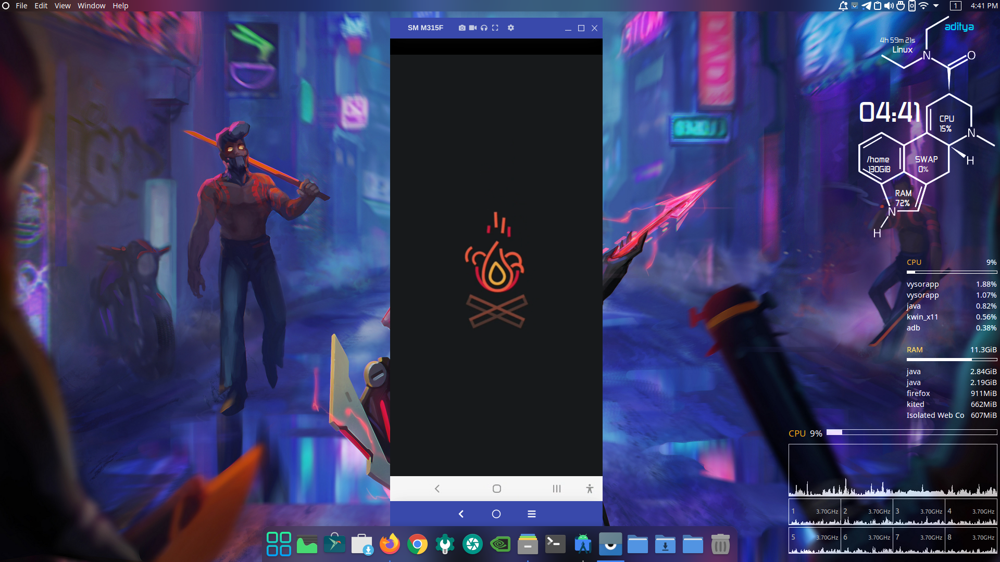
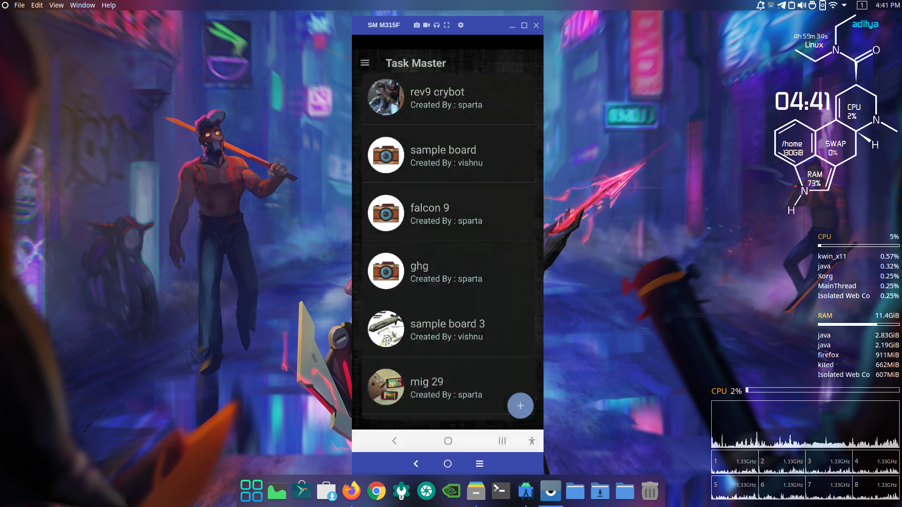
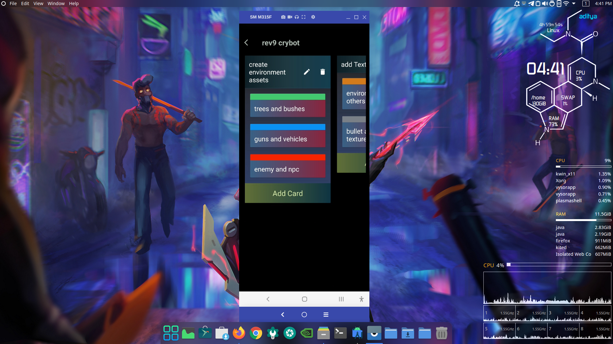
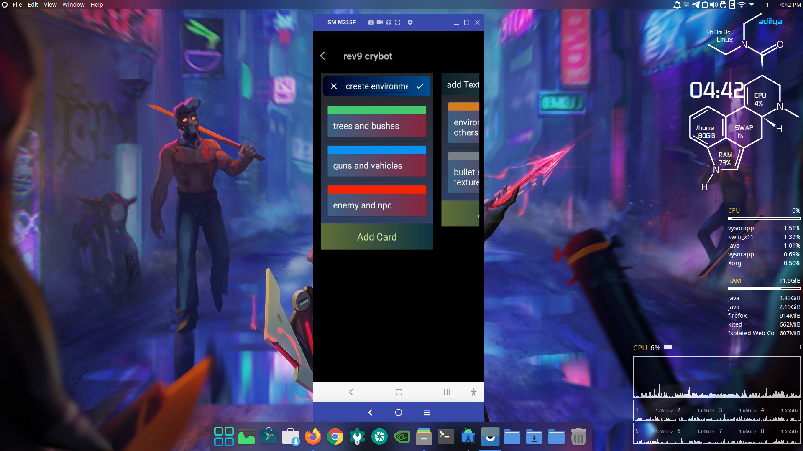
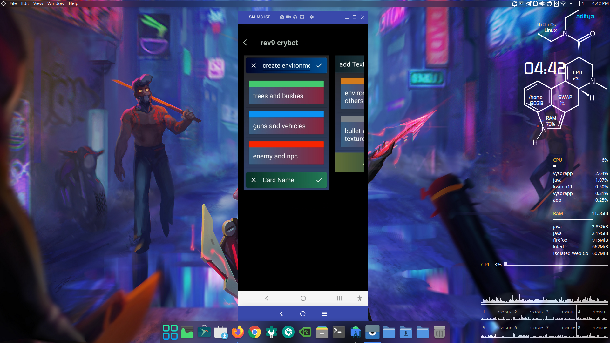
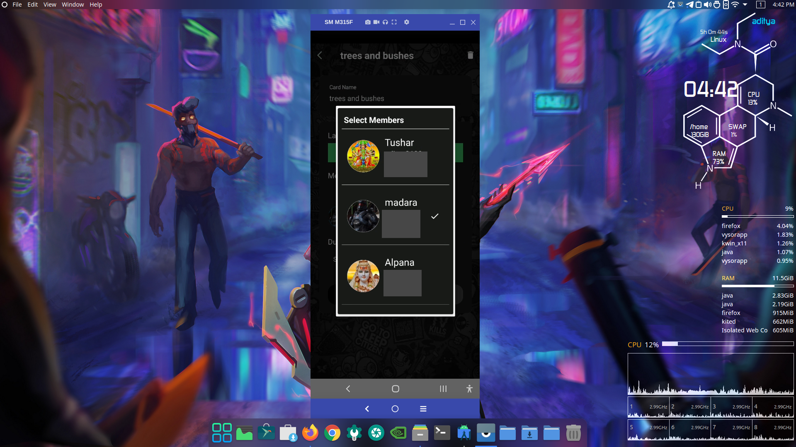
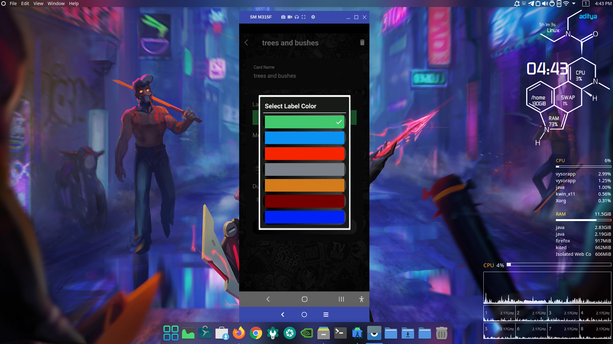
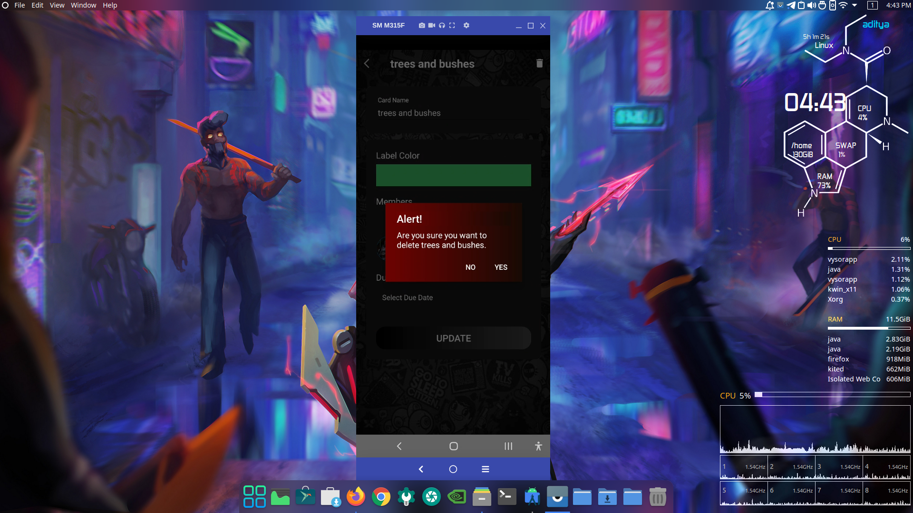
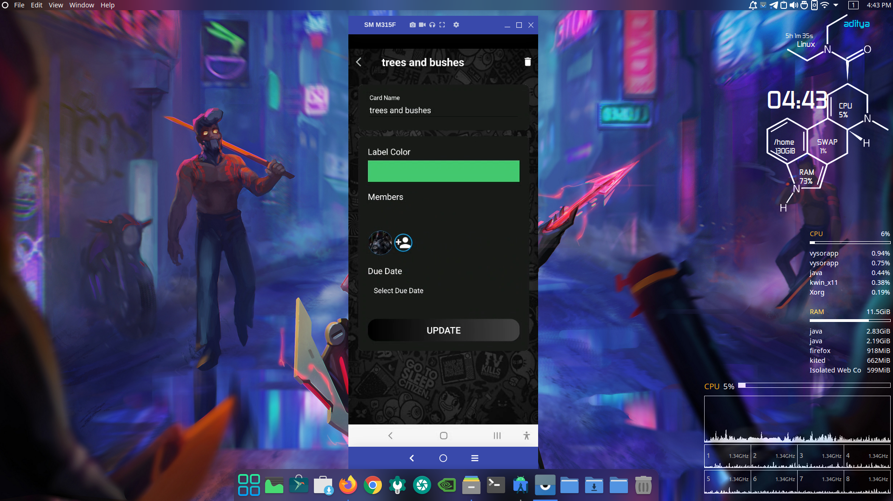
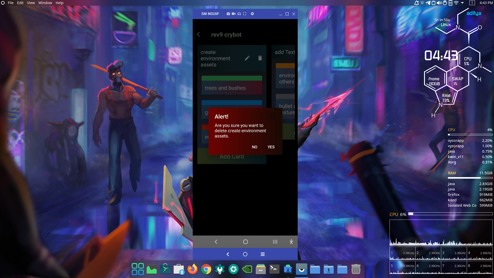
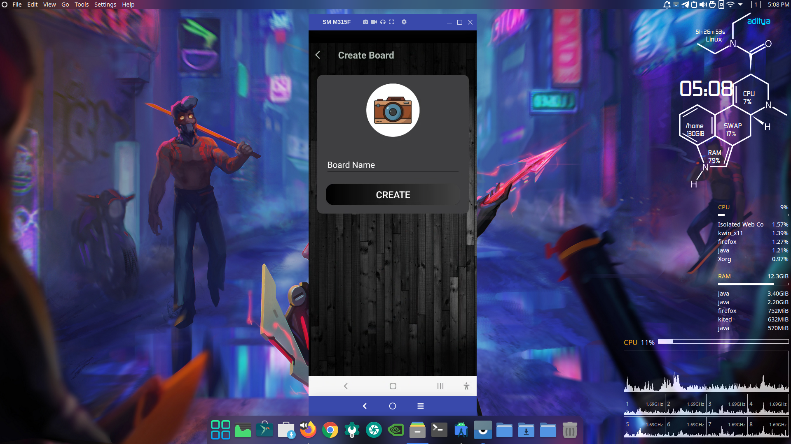
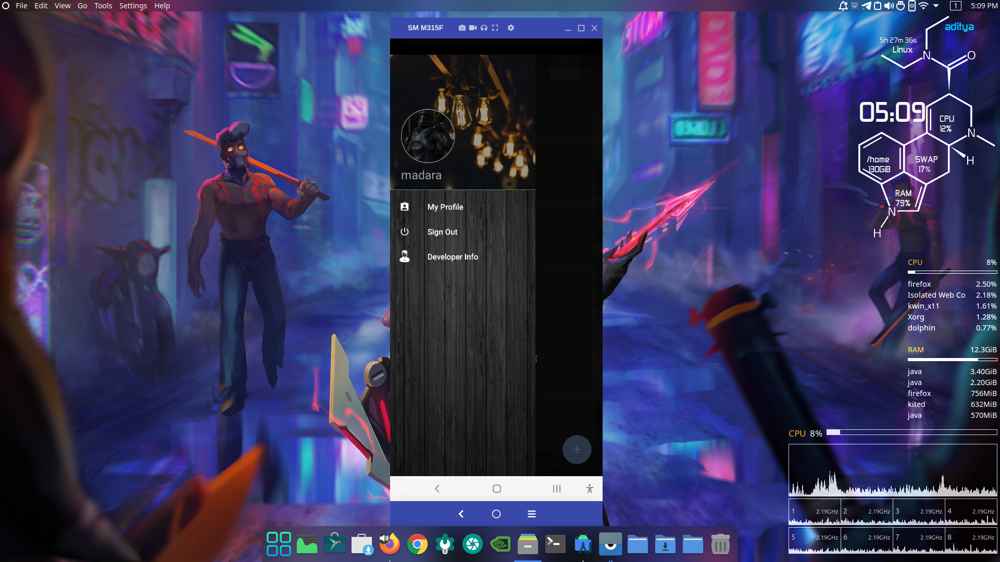
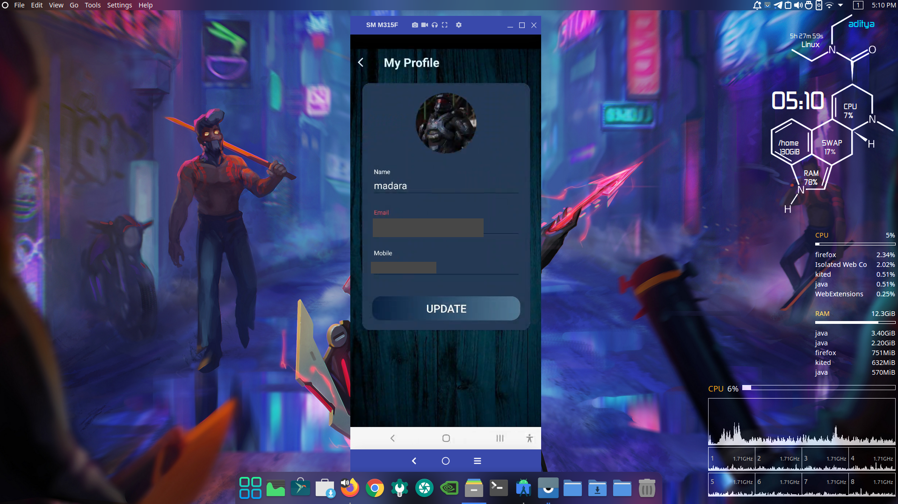
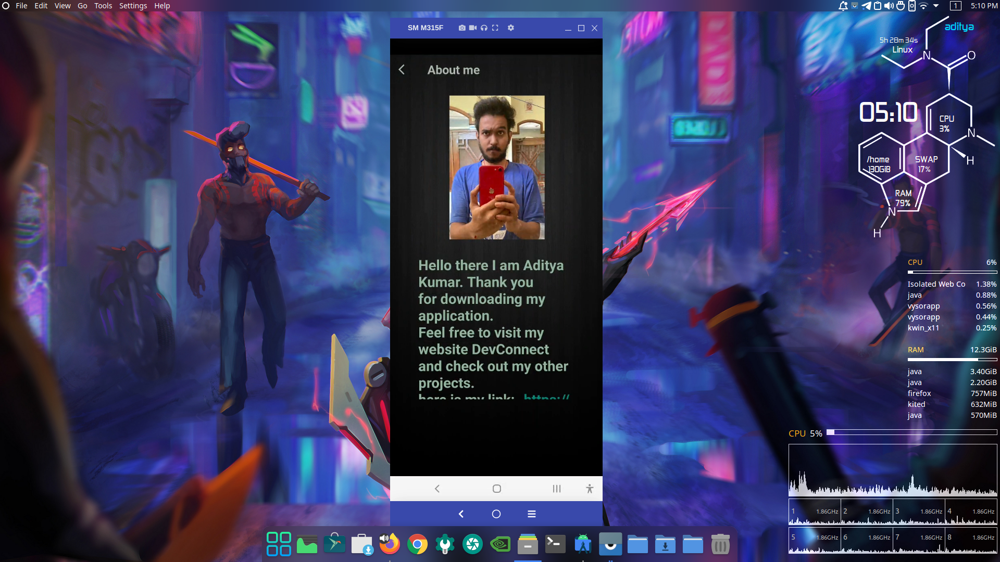
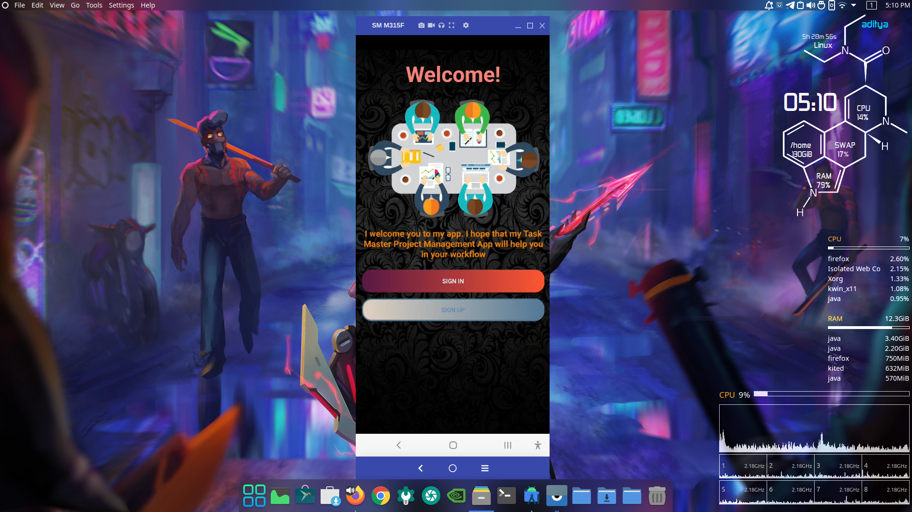
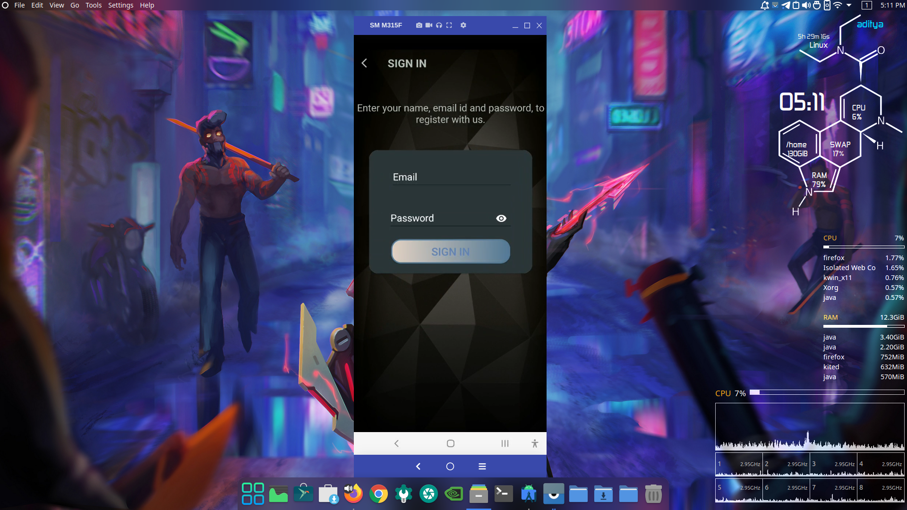
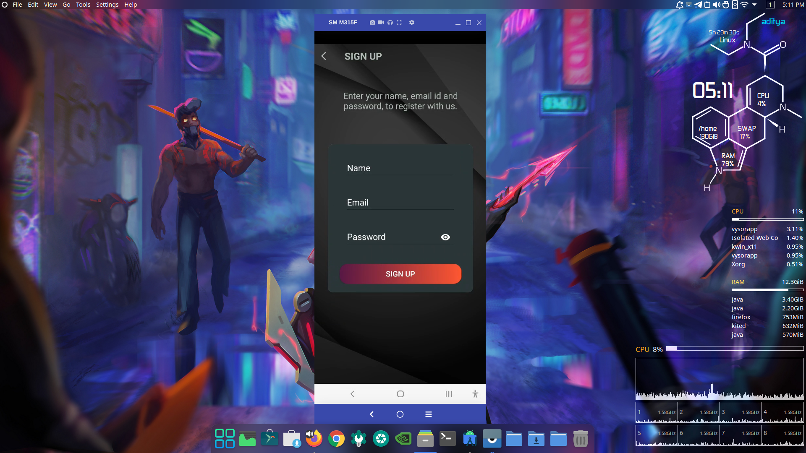
